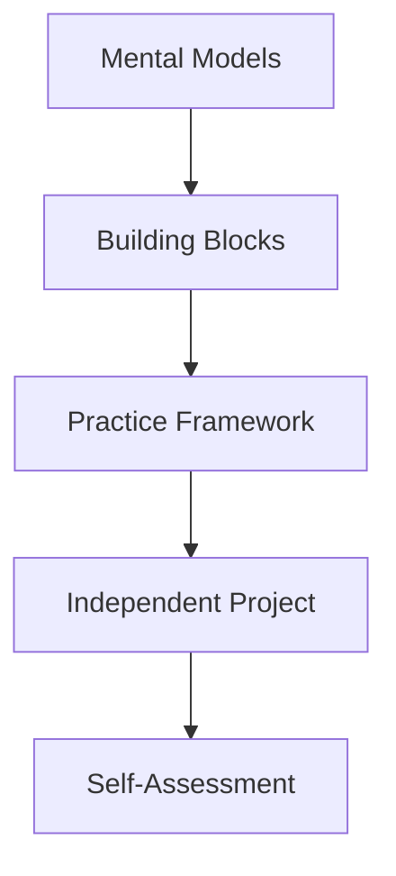

# 📘 JavaScript Form Validation Mastery: Building User-Friendly Web Forms

## 🎯 Learning Journey Overview

Welcome to Day 24! Today, we transform from **code writers** to **user experience architects**. Form validation isn't just about technical rules—it's about creating smooth, professional experiences like Careem's seamless booking or Daraz's checkout process.

### 🏗️ Architecture of Today's Learning


---

# 📚 PART 1: CONCEPT FOUNDATION

## 🏙️ The Lahore Mall Security Analogy

Imagine you're entering Packages Mall in Lahore. The security process teaches us everything about form validation:

**🎯 Security Check = Form Validation**
- **Entry Gate Check (Client-side)**: Quick bag check at entrance → instant feedback
- **Inner Security (Server-side)**: Detailed check inside → backup security
- **Bad Experience**: Getting to billing counter, then told your bag isn't allowed → wasted time!

**Why BOTH validations matter:**
```javascript
// Like Packages Mall security levels:
Client-side validation = Gate security (quick check)
Server-side validation = Inner mall security (thorough check)
```

## 🔍 Why Validation Exists: The Pakistani Context

### 🛡️ **Security First: The Bank Locker Principle**
Think of your form data like a bank locker at HBL:
- **Weak password** = Locker with simple lock
- **No validation** = Bank accepting torn deposit slips
- **Good validation** = Bank verifying your CNIC, signature, and account details

### 📱 **User Experience: The Careem Standard**
When you book a Careem ride:
1. **Instant feedback**: "Please enter pickup location" appears immediately
2. **Clear errors**: "Cannot book past trips" with explanation
3. **Progressive enable**: "Book Now" button activates when all details are valid

### 💡 **Four Pillars of Form Validation:**

| Pillar | Pakistani Example | Technical Benefit |
|--------|-------------------|-------------------|
| **User Experience** | Jazz recharge - instant error if wrong number | No waiting for server response |
| **Security** | Bank app OTP format validation | Prevents malicious data attacks |
| **Data Quality** | NADRA form - prevents "Mickey Mouse" names | Clean database, accurate analytics |
| **Professionalism** | Daraz checkout - guides you step by step | Builds trust, reduces support calls |

## 🧠 Building Your Mental Model

### 📧 Email Validation = CNIC Format Checking

Your email address is like a Pakistani CNIC:
- **Local part** (before @) = Your name: `ali.ahmed`
- **@ symbol** = "son/daughter of" in Urdu: `@`
- **Domain** (after @) = Your city: `lahore`
- **TLD** = Your province: `.pk`

**CNIC Rules Comparison:**
```
CNIC: 12345-6789012-3
✓ Must have exactly 2 dashes
✓ Must have 13 digits total
✓ Last digit is check digit

Email: ali.ahmed@company.com.pk
✓ Must have exactly 1 @ symbol
✓ Must have text before and after @
✓ Must have dot after @
✓ Must have text after dot
```

### 🔑 Password Strength = Bank Locker Security Levels

Think of password strength like HBL locker security:

| Strength Level | Locker Equivalent | Password Features |
|----------------|-------------------|-------------------|
| **Weak (1-2)** | Padlock on diary | Only letters, short |
| **Medium (3-4)** | Home safe | Letters + numbers, 8+ chars |
| **Strong (5)** | Bank vault | All character types, 12+ chars |

## 🤔 Pause and Reflect

**Question 1:** Think of three Pakistani apps you use regularly. What validation do they perform, and how does it help your experience?

**Question 2:** Imagine you're designing a BISP (Benazir Income Support) registration form. What validations would be MOST critical and why?

---

# 🔨 PART 2: FUNDAMENTAL BUILDING BLOCKS

## 🚫 Building Block 1: Preventing Page Refresh

### The Traffic Signal Analogy
Imagine you're driving in Karachi traffic. Form submission without `preventDefault()` is like:
- **Without**: Running red light → accident (page reloads, data lost)
- **With**: Stopping at red → checking intersection → proceeding safely

### 🧩 Minimal Code Understanding

```javascript
// Think of this as your form's "traffic signal controller"
const form = document.querySelector('form');

form.addEventListener('submit', (event) => {
  // This is the RED LIGHT - STOP!
  event.preventDefault();
  
  // Now we can safely check the intersection (validate)
  console.log("Form stopped from refreshing!");
  // Your validation code goes here
});
```

### ❌ Common Mistake & Fix

```javascript
// WRONG: Letting the car crash (page refreshes)
form.addEventListener('submit', () => {
  validateForm(); // Too late! Page already refreshing
});

// RIGHT: Stopping at red light first
form.addEventListener('submit', (event) => {
  event.preventDefault(); // STOP!
  validateForm(); // Now safe to check
});
```

## 📧 Building Block 2: Email Structure Validation

### 🎯 Thinking Process First
Before writing regex, let's think through email rules:

1. **Must have exactly one `@`** → Like CNIC must have 2 dashes
2. **Text before `@` cannot be empty** → Like name in "Ali s/o Ahmed"
3. **Text after `@` cannot be empty** → Like city in CNIC address
4. **Must have a dot after `@`** → Like `.pk` in Pakistani domains
5. **Text after dot cannot be empty** → Like "com" in ".com"

### 🔍 Step-by-Step Building (NO REGEX YET!)

**Step 1: Check for @ symbol existence**
```javascript
function hasAtSymbol(email) {
  // TODO: How do we check if a string contains '@'?
  // Hint: Strings have a method that returns true/false
  return email.includes('___'); // Fill the blank
}
```

**Step 2: Split and check both parts**
```javascript
function hasTextBeforeAndAfterAt(email) {
  if (!hasAtSymbol(email)) return false;
  
  const parts = email.split('@');
  // TODO: What should we check about 'parts'?
  // How many parts? Should they be empty?
  // Fill in the conditions:
  return parts.length === ___ && 
         parts[0].length > ___ && 
         parts[1].length > ___;
}
```

**Step 3: Check for dot in domain**
```javascript
function hasDotInDomain(email) {
  if (!hasTextBeforeAndAfterAt(email)) return false;
  
  const domain = email.split('@')[1];
  // TODO: Check if domain contains a dot
  // AND there's text after the dot
  const dotParts = domain.split('.');
  return dotParts.length >= ___ && 
         dotParts[dotParts.length - 1].length > ___;
}
```

### 🧪 Test Your Understanding
```javascript
// Test these emails - which should pass/fail?
const testEmails = [
  "ali@",              // Should fail: No domain
  "@gmail.com",        // Should fail: No local part
  "ali@gmail",         // Should fail: No dot in domain
  "ali@gmail.com",     // Should pass: Perfect
  "ali.ahmed@co.uk"    // Should pass: Multiple dots OK
];

// Try to trace through your functions for each email
```

## 🔐 Building Block 3: Password Strength Meter

### 🏦 The Bank Security Levels

Let's build password strength like HBL evaluates loan applications:

```javascript
function checkPasswordStrength(password) {
  let score = 0; // Start with zero points
  
  // Rule 1: Length requirement (like age requirement)
  if (password.length >= 8) score++;
  
  // Rule 2: Lowercase letters (basic requirement)
  if (/[a-z]/.test(password)) score++;
  
  // Rule 3: Uppercase letters (additional security)
  if (/[A-Z]/.test(password)) score++;
  
  // Rule 4: Numbers (like PIN requirement)
  if (/[0-9]/.test(password)) score++;
  
  // Rule 5: Special chars (like biometric verification)
  if (/[^a-zA-Z0-9]/.test(password)) score++;
  
  return score; // 0-5 scale
}
```

### 🔄 Real-Time Feedback System

**The Careem Driver Rating Analogy:**
As you type password, imagine you're watching your Careem driver rating update:

```javascript
passwordInput.addEventListener('input', () => {
  const strength = checkPasswordStrength(passwordInput.value);
  const meter = document.getElementById('strength-meter');
  
  // TODO: Complete this feedback system
  // Based on strength score (0-5), show appropriate message
  
  if (strength < 2) {
    meter.textContent = '🚫 Very Weak - Like using "1234" as ATM PIN';
    meter.style.color = 'red';
  } else if (strength < 3) {
    // TODO: What message for medium-weak?
  } else if (strength < 4) {
    // TODO: What message for medium?
  } else {
    // TODO: What message for strong?
  }
});
```

## 📞 Building Block 4: Pakistani Phone Validation

### 🇵🇰 Understanding Pakistani Phone Structure

Think of Pakistani mobile numbers like this:
```
03XX-XXXXXXX
│ │   └─── 7 digits for subscriber
│ └────── 2 digits for mobile operator
└──────── "03" for mobile network prefix
```

### 🧩 Building the Validator Step by Step

**Step 1: Remove formatting for clean checking**
```javascript
function cleanPhoneNumber(phone) {
  // Remove spaces, dashes, plus sign
  // TODO: What string method removes characters?
  return phone.replace(/[\s\-+]/g, '');
}
```

**Step 2: Check basic requirements**
```javascript
function validatePakistanPhone(phone) {
  const cleaned = cleanPhoneNumber(phone);
  
  // Rule 1: Must be 11 digits (like CNIC is 13)
  if (cleaned.length !== 11) {
    return 'Phone must be exactly 11 digits';
  }
  
  // Rule 2: Must start with 03 (mobile networks)
  if (!cleaned.startsWith('03')) {
    return 'Pakistani mobile must start with 03';
  }
  
  // Rule 3: Must be all numbers
  if (!/^\d+$/.test(cleaned)) {
    return 'Phone can only contain numbers';
  }
  
  return null; // No error = valid
}
```

### 🤔 Pause and Think
**Question:** Why do we use `startsWith('03')` instead of `charAt(0) === '0' && charAt(1) === '3'`?

**Challenge:** How would you modify this for landline numbers (042-XXXXXXX)?

---

# 🛤️ PART 3: PROGRESSIVE LEARNING PATH

## 🎓 I Do → We Do → You Do Framework

### 🎯 TIER 1: I Do - Basic Field Validation (30 min)

**Scenario:** You're building a Jazz World login form

```javascript
// I'll show you how to start, then you complete it

// HTML elements (assume they exist in your HTML)
const emailInput = document.getElementById('jazz-email');
const passwordInput = document.getElementById('jazz-password');
const submitBtn = document.getElementById('jazz-submit');

// 1. Email validation on blur (when user leaves field)
emailInput.addEventListener('blur', () => {
  const email = emailInput.value.trim();
  
  // TODO: Complete this validation logic
  // Check 1: Is it empty?
  if (email === '') {
    showError(emailInput, 'Email is required for Jazz World');
    return;
  }
  
  // Check 2: Does it contain @?
  // TODO: Add your code here
  
  // Check 3: Is there text after @?
  // TODO: Add your code here
  
  // If all checks pass:
  clearError(emailInput);
});

// 2. Password validation (minimum 6 characters)
passwordInput.addEventListener('input', () => {
  // TODO: Check if password has at least 6 characters
  // Enable/disable submit button based on both fields
});

function showError(input, message) {
  // TODO: Implement error display
  // Hint: You can add a red border and show message
}

function clearError(input) {
  // TODO: Implement clearing error
}
```

### 👥 TIER 2: We Do - Phone Number Validation (45 min)

**Scenario:** Validating Ufone numbers for a recharge form

Let's build this TOGETHER:

```javascript
function validateUfoneNumber(phone) {
  // Step 1: Clean the number
  const cleaned = phone.replace(/[\s\-]/g, '');
  
  // Step 2: Check length
  // YOUR TURN: Write the length check (must be 11 digits)
  if (/* your condition here */) {
    return 'Ufone numbers must be 11 digits';
  }
  
  // Step 3: Check if it starts with 033 (Ufone prefix)
  // YOUR TURN: Write the prefix check
  if (!/* your condition here */) {
    return 'Ufone numbers start with 033';
  }
  
  // Step 4: Check if all characters are digits
  // HINT: Use a regex or check each character
  
  return null; // Valid
}

// Test cases - work through these together:
console.log(validateUfoneNumber('0333-1234567')); // Should pass
console.log(validateUfoneNumber('0300-1234567')); // Should fail (not Ufone)
console.log(validateUfoneNumber('0333-12X4567')); // Should fail (contains X)
```

### 🧑💻 TIER 3: You Do - Real-Time Form Feedback (60 min)

**Challenge:** Create a Foodpanda-style signup form with live feedback

**Requirements:**
1. Name field: Show character count (3-50 characters)
2. Email field: Green checkmark when valid, red X when invalid
3. Password: Strength meter updates with every keystroke
4. Confirm Password: Shows "Match" or "Don't Match" instantly
5. Submit button: Only enabled when ALL fields are valid

**Starter Code:**
```html
<!-- Your HTML structure -->
<div class="form-group">
  <label for="foodpanda-name">Full Name</label>
  <input type="text" id="foodpanda-name">
  <span class="char-count">0/50</span>
  <span class="validation-icon"></span>
</div>
```

```javascript
// Your JavaScript skeleton
const nameInput = document.getElementById('foodpanda-name');
const charCount = document.querySelector('.char-count');

nameInput.addEventListener('input', () => {
  // TODO: Update character count
  // TODO: Show validation icon based on length
  // TODO: Enable/disable submit button
});

// HINTS for implementation:
// 1. Use textContent to update character count
// 2. Create validateName() function that returns error message or null
// 3. Use classList.add/remove to show green/red icons
// 4. Create a checkAllFieldsValid() function for submit button
```

## 🔧 Debugging Strategies

### 🐛 Common Validation Bugs & Fixes

| Bug Symptom | Likely Cause | Pakistani Analogy | Solution |
|------------|--------------|-------------------|----------|
| Form submits even when invalid | Missing `event.preventDefault()` | Traffic signal always green | Add the red light! |
| Error shows then disappears | Validation on wrong event | Security guard leaving post | Use `blur` not `focus` |
| Password accepts "123456" | No strength checking | Bank accepting simple lock | Add complexity rules |
| Pakistani phone rejected | Not handling dashes/spaces | NADRA rejecting formatted CNIC | Clean input first |

### 🧪 Testing Framework for Validation

Create your own test suite like PECHS testing lab:

```javascript
function runValidationTests() {
  const tests = [
    {
      input: "ali@gmail.com",
      expected: "valid",
      description: "Standard email should pass"
    },
    {
      input: "ali@.com",
      expected: "invalid",
      description: "No text before @ should fail"
    },
    // TODO: Add 5 more test cases
  ];
  
  tests.forEach(test => {
    const result = validateEmail(test.input) ? "valid" : "invalid";
    if (result === test.expected) {
      console.log(`✅ PASS: ${test.description}`);
    } else {
      console.log(`❌ FAIL: ${test.description}`);
      console.log(`   Expected: ${test.expected}, Got: ${result}`);
    }
  });
}
```

---

# 🚀 PART 4: INDEPENDENT APPLICATION

## 🎯 Project: "Careem-Style Signup Form"

### 📋 Project Requirements (Without Complete Solutions)

**Business Context:** You're building the signup form for Careem's expansion to smaller Pakistani cities. The form must be foolproof for first-time smartphone users.

**Technical Requirements:**
1. **Name Field**: 3-50 characters, only letters/spaces (English or Urdu eventually)
2. **Email Field**: Standard format validation with instant feedback
3. **Pakistani Phone**: 11 digits, starts with 03, accepts formatted input (03XX-XXXXXXX)
4. **Password**: Strength meter showing 5 levels with Pakistani metaphors
5. **Confirm Password**: Live matching indicator
6. **Terms Checkbox**: Must be checked to submit
7. **Submit Button**: Dynamically enabled/disabled based on all validations

### 🎨 Success Criteria

Your form is successful when:

**✅ Functional Requirements:**
- [ ] All 5 fields validate correctly against edge cases
- [ ] Real-time feedback appears within 500ms of user action
- [ ] Password strength updates with every keystroke
- [ ] Submit button state clearly indicates readiness
- [ ] Form resets properly after successful submission

**✅ User Experience Requirements:**
- [ ] Error messages are helpful (not just "Invalid")
- [ ] Color coding follows accessibility standards (red/green plus icons)
- [ ] Form works for keyboard-only users (tab navigation)
- [ ] Mobile-responsive design (test on phone emulator)

**✅ Code Quality Requirements:**
- [ ] No duplicate validation logic
- [ ] Functions are pure and testable
- [ ] Event listeners are properly cleaned up
- [ ] Code is commented with "why" not just "what"

### 🧩 Starter Code with TODOs

```html
<!DOCTYPE html>
<html lang="en">
<head>
  <meta charset="UTF-8">
  <title>Careem Pakistan Signup</title>
  <style>
    /* TODO: Add CSS for validation states */
    /* HINT: Use .valid and .invalid classes */
    /* Remember colorblind users! */
  </style>
</head>
<body>
  <form id="careem-signup">
    <!-- TODO: Build form structure -->
    <!-- Include all 5 fields with labels -->
    <!-- Add error message spans -->
    <!-- Add success indicators -->
    
    <button type="submit" id="submit-btn" disabled>
      Create Careem Account
    </button>
  </form>

  <script>
    // ===== VALIDATION FUNCTIONS (TO COMPLETE) =====
    
    function validateName(name) {
      // TODO: Implement name validation
      // Return error message or null
    }
    
    function validateEmail(email) {
      // TODO: Implement WITHOUT using the complete regex from curriculum
      // Build it step by step as taught
    }
    
    function validatePhone(phone) {
      // TODO: Accept 03XX-XXXXXXX or 03XXXXXXXXX
      // Clean first, then validate
    }
    
    function getPasswordStrength(password) {
      // TODO: Return 0-5 with descriptive levels
      // Use Pakistani metaphors for each level
    }
    
    // ===== EVENT HANDLERS (TO COMPLETE) =====
    
    // TODO: Add real-time validation for each field
    // TODO: Implement dynamic submit button
    // TODO: Add form submission handler
    
    // ===== HELPER FUNCTIONS (TO CREATE) =====
    
    // TODO: create showError(field, message)
    // TODO: create showSuccess(field, message)
    // TODO: create updateSubmitButton()
  </script>
</body>
</html>
```

### 🔍 Testing Guidelines

Test your form with these Pakistani-specific test cases:

**Name Field Tests:**
- "Ali" → Should pass (minimum 3)
- "Muhammad Ali Khan" → Should pass
- "Al" → Should fail (too short)
- "123Ali" → Should fail (numbers not allowed)
- "A".repeat(51) → Should fail (too long)

**Phone Field Tests:**
- "0300-1234567" → Should pass
- "0321-9876543" → Should pass
- "042-1234567" → Should fail (landline)
- "03XX-1234567" → Should fail (letters)
- "0092-300-1234567" → Should fail (international format)

### 🏆 Extension Challenges

**Bronze Challenge:** Add Urdu name support (allow Arabic Unicode characters)

**Silver Challenge:** Implement "Show Password" toggle with eye icon

**Gold Challenge:** Add profile picture validation (max 2MB, only JPG/PNG)

**Platinum Challenge:** Create API simulation that shows loading state and handles server errors

## 📝 Self-Assessment Questions

### 🤔 Reflection Questions
1. How would you explain `event.preventDefault()` to a complete beginner using a Pakistani analogy?
2. What are the trade-offs between validating on `blur` vs `input` events?
3. How could you make your validation accessible to screen reader users?

### 🧠 Knowledge Check
```javascript
// What will this validation function return for each input?
function mysteryValidation(input) {
  return input.trim() !== '' && 
         input.length >= 3 && 
         input.length <= 50 && 
         /^[a-zA-Z\s]+$/.test(input);
}

// Test cases - predict the results:
console.log(mysteryValidation("Ali"));      // ?
console.log(mysteryValidation(""));         // ?
console.log(mysteryValidation("Ali123"));   // ?
console.log(mysteryValidation("A"));        // ?
```

### 👥 Peer Teaching Exercise
**Task:** Explain regular expressions to a friend using ONLY Pakistani analogies (no technical terms).

**Success when:** Your friend can identify valid/invalid emails without seeing any code.

---

## 🎉 Congratulations!

You've just built the foundation for creating professional, user-friendly web forms. Remember: Good validation is invisible—users only notice it when it's missing or poorly done.

**💡 Final Thought:** The best validation feels like a helpful friend guiding you, not a strict teacher correcting you. Your forms should make users feel confident, not frustrated.

**📚 Next Steps:** Save this guide and revisit it when building forms. Each time, try to implement ONE new validation concept you learned today.

---